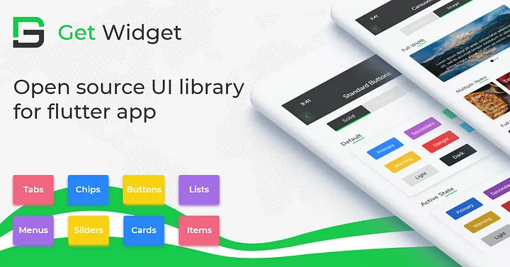
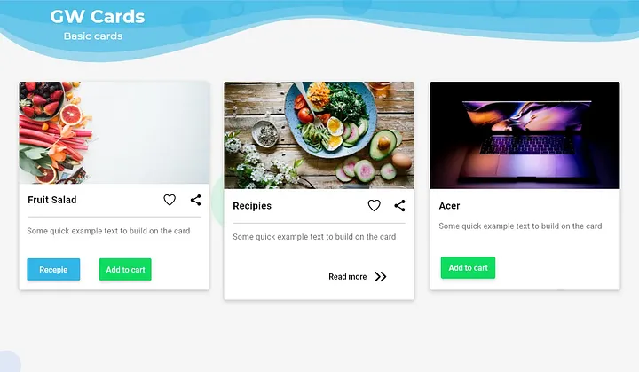
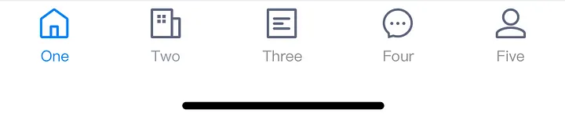
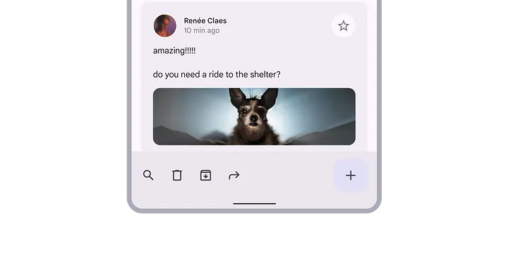

3 Must-Have Flutter UI Libraries to Stop Reinventing the Wheel 🔥
How Top Developers Ship Beautiful Apps 3x Faster

1. GetWidget — A Comprehensive, One-Stop UI Toolkit

GetWidget is a powerful, open-source Flutter UI library that offers over 1,000 ready-to-use widgets. It includes buttons, lists, navigation bars, or other common interface elements. For newcomers, it is like LEGO bricks and snap together professional interfaces without reinventing the wheel.

When to Use It?
If you’re building similar common apps layouts (e.g. login forms, settings screens), GetWidget provides instant solutions out of the box. It is perfect for cross-platform projects.

// Add the dependency into pubspec.yaml file
dependencies:
  getwidget: ^2.0.4

// You can easily build flutter cards with simple codes.
import 'package:getwidget/getwidget.dart';

GFCard(
 boxFit: BoxFit.cover,
 image: Image.asset('your asset image'),
 title: GFListTile(
   avatar: GFAvatar(
     backgroundImage: AssetImage('your asset image'),
   ),
   title: Text('Card Title'),
   subTitle: Text('Card Sub Title'),
),
content: Text("Some quick example text to build on the card"),
buttonBar: GFButtonBar(
 children: <Widget>[
   GFButton(
    onPressed: () {},
    text: 'Buy',
   ),
   GFButton(
    onPressed: () {},
    text: 'Cancel',
   ),
 ],
 ),
),

Key Advantages
🚀Instant usability: You can dive right in — minimal learning curve and zero hassle
📖 Strong documentation & community: Great resources and active community support
⏳ Faster development: Reduce UI development time by at least 40% — spend less time coding, more time building cool features.

2. Bruno — Elegant UI Solution by Beike Corp

Bruno is a beautifully designed open-source Flutter UI toolkit developed by Beike Corp (China’s $30B real estate platform), specifically crafted for rapidly creating business-oriented or enterprise applications.

// Add the dependency into pubspec.yaml file
dependencies:
  bruno: ^3.4.3

// You can easily create business-oriented bottom tab bar with codes
var titles = ['One', 'Two', 'Three', 'Four', 'Five','Six'];
BrnBottomTabBar(
  fixedColor: Colors.blue,
  currentIndex: _selectedIndex,
  onTap: _onItemSelected,
  badgeColor: Colors.red,
  items: <BottomTabBarItem>[
    BottomTabBarItem(
      icon: Image(image: AssetImage("assets/icons/navbar\_fangyuan.png")),activeIcon: Image(image: AssetImage("assets/icons/navbar\_fangyuan.png")), title: Text(titles[0])),
    BottomTabBarItem(icon: Image(image: AssetImage("assets/icons/navbar\_fangyuan.png")), title: Text(titles[1])),
    BottomTabBarItem(icon: Image(image: AssetImage("assets/icons/navbar\_fangyuan.png")), title: Text(titles[2])),
    BottomTabBarItem(
      icon: Image(image: AssetImage("assets/icons/navbar\_fangyuan.png")),
      activeIcon: Image(image: AssetImage("assets/icons/navbar\_fangyuan.png")),
      title: Text(titles[3])),
    BottomTabBarItem(icon: Image(image: AssetImage("assets/icons/navbar\_fangyuan.png")), title: Text(titles[4])),
    BottomTabBarItem(icon: Image(image: AssetImage("assets/icons/navbar\_fangyuan.png")), title: Text(titles[5])),
  ],
)

Key Advantages
🌟 Rich business components: Includes form validations, dialogs, lists and more
⚡ Rapid prototyping: Pre-designed components reduce UI development time
📱 Consistent multi-platform design: Optimized for smooth performance on both Android and iOS.

3. VelocityX — Responsive UI and Easy State Management

VelocityX is an innovative Flutter UI toolkit emphasizing responsive design, making it easy to build adaptive UIs for web and mobile. It includes convenient built-in responsive utilities and a simplified state management solution, perfect for small-scale projects.

// Add the dependency into pubspec.yaml file
dependencies:
    velocity_x: ^3.3.0

// You can create adaptive flutter ui box with velocityX codes
import "package:velocity_x/velocity_x.dart";
Widget build(BuildContext context) {
  return VxBox(child: Text("VelocityX")).red500.make().centered();
}

Key Advantages
🎯 Responsive by design: Easily build adaptive layouts without external complexity
🔧 Built-in handy tools: Includes padding, margins, typography adjustments, and more
⚙️ Simple state management: Comes integrated with basic state management, ideal for small to medium projects

Flutter Material 3: The Next Evolution in UI Design
If after exploring third-party toolkit you’re still leaning towards Flutter’s native UI capabilities, then Material 3 (also known as Material You) is your best bet. Material 3 is Google’s latest design specification, officially released alongside Android 12. It introduces dynamic color schemes, adaptive theming, modernized UI components, and significant improvements in interactivity.

theme: ThemeData(
  primarySwatch: Colors.blue,
  useMaterial3: true, // set true to enable material3
),

// You can create flutter material3 component 
import 'package:flutter/material.dart';
void main() => runApp(const MyApp());

class MyApp extends StatelessWidget {
  const MyApp({super.key});

  @override
  Widget build(BuildContext context) {
    const String appTitle = 'Flutter layout demo';
    return MaterialApp(
      title: appTitle,
      home: Scaffold(
        appBar: AppBar(title: const Text(appTitle)),
        body: const Center(
          child: Text('Hello World'),
        ),
      ),
    );
  }
}

Key Advantages
🎨 Unified Google Design Language
Material 3 aligns your app’s UI closely with Android 12’s system interfaces and Google’s own applications, and creates seamless interactions across different devices
🌐 Official Support and High Stability
Material 3 enjoys long-term maintenance from Google’s Flutter team. This ensures continuous updates, excellent compatibility, and high stability
✨ Modernized Components
Material 3 updates many familiar UI elements, providing cleaner, more intuitive versions of buttons, cards and more.